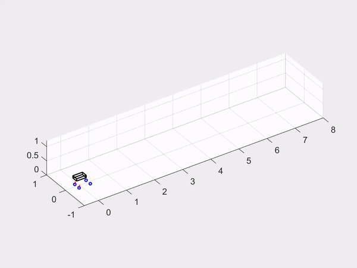
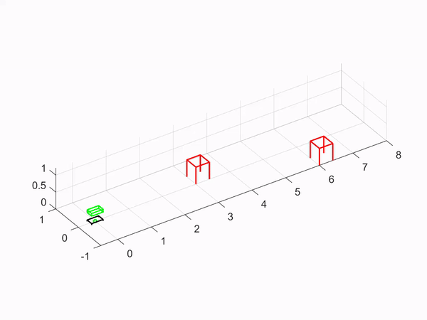

# ee599-controls-project

## Casadi
[Casadi toolbox](https://web.casadi.org/)

## Demos

Quadruped MPC demo - quad_walk_ctr\
BRT with floating base dynamics - brt\

## Gait demo

## Obstacle avoidance via BRT

